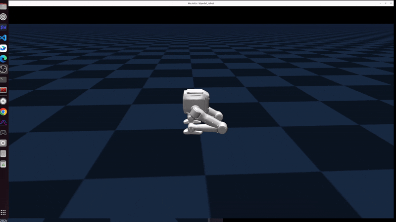
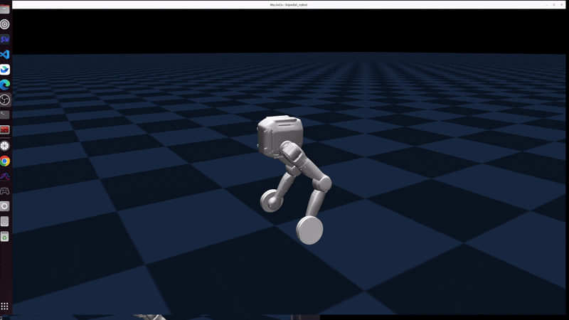
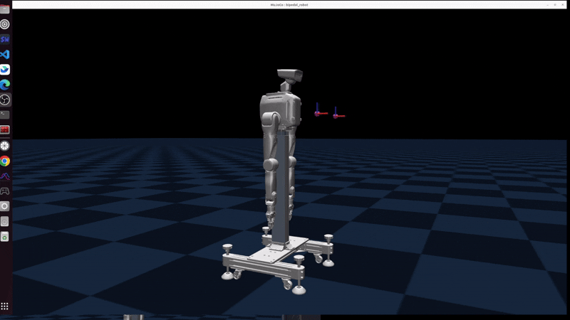
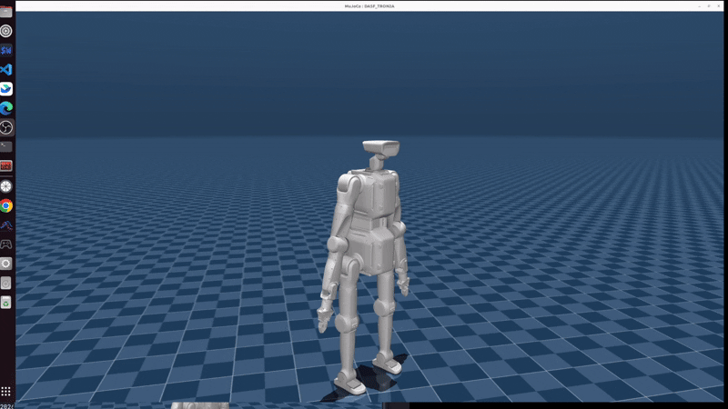

# English | [中文](README_zh-CN.md)

<!--
  SPDX-FileCopyrightText: 2024-2026 LimX Dynamics Technology Co., Ltd.
  SPDX-License-Identifier: Apache-2.0
-->

> **Distribution.** The primary public distribution point for this
> repository is GitHub:
> <https://github.com/limxdynamics/tron2_mujoco_sim>. The internal
> LimX GitLab is a mirror; open issues, PRs, and security reports on
> the GitHub repository.

# tron2-mujoco-sim

MuJoCo simulator for the TRON2 robot family. It bridges the LimX low-level SDK
(`RobotCmd` / `RobotState` carrying `q` / `dq` / `tau` / `Kp` / `Kd`, plus
`ImuData` and gripper messages) to `mujoco.MjData`, so the same controller wire
format that drives a physical robot can be exercised against a simulated one.

A robot variant is declared, not hard-coded: it is a set of joint channels plus
optional modules, assembled in `tron2_sim/variants/`. Every channel of every
supported variant runs over the SDK's `*ForSim` simulator-side API — there is no
second messaging stack.

## License and attribution

Apache License, Version 2.0. See [`LICENSE`](LICENSE); SPDX identifier
`Apache-2.0`.

- [`NOTICE`](NOTICE) — required attribution notice.
- [`THIRD_PARTY_NOTICES.md`](THIRD_PARTY_NOTICES.md) — per-submodule and
  per-dependency provenance.
- [`SECURITY.md`](SECURITY.md) — how to report a vulnerability, and the
  simulation-versus-hardware boundary.
- [`CONTRIBUTING.md`](CONTRIBUTING.md) — development workflow, submodule
  procedure, DCO sign-off.
- [`CHANGELOG.md`](CHANGELOG.md) — release notes and items blocked on upstream.

## Scope

**Included:** `simulator.py`, the `tron2_sim/` package (including the shipped
gripper calibration under `tron2_sim/config/`), and documentation. Submodules
are *declared* (pinned by commit) but not vendored:

- `robot-description/` — URDF / MJCF models and meshes.
- `robot-joystick/` — gamepad helper binary used to drive a controller
  by hand (see [§3a Gamepad control](#3a-gamepad-control)).
- `limxsdk-lowlevel/` — LimX low-level SDK with pre-built wheels.

**Excluded by design:** trained control policies (`.onnx`, `.pt`, `.pth`,
`.ckpt`), SDK binaries or wheels committed into this tree, calibration values,
firmware, bag captures, and hard-coded private network addresses. Command
examples use the placeholder `<robot-ip>`; the default endpoint is `127.0.0.1`.

## 1. Dependencies and deployment

| Dependency | Version | Notes |
|---|---|---|
| Python | >= 3.10 | verified on 3.10 |
| `mujoco` | >= 3.2.2 | physics and passive viewer |
| `PyYAML` | >= 6.0 | reads `tron2_sim/config/gripper_config.yaml` |
| `limxsdk` | 4.8+ | architecture-specific wheel inside the `limxsdk-lowlevel` submodule; installed separately, always with `--no-deps` |

Clone first, either way:

```bash
git clone --recurse-submodules https://github.com/limxdynamics/tron2_mujoco_sim.git
cd tron2-mujoco-sim
```

If you already cloned without submodules, run
`git submodule update --init --recursive` before continuing.

### Option A: uv (recommended)

[uv](https://docs.astral.sh/uv/) installs the right Python, resolves everything
from the committed `uv.lock`, and needs no manual virtualenv:

```bash
curl -LsSf https://astral.sh/uv/install.sh | sh   # install uv
uv sync --extra sdk                               # physics + SDK

export ROBOT_TYPE=SF_TRON2A
uv run simulator.py                               # with viewer
uv run simulator.py --headless                    # no graphics (CI / remote)
uv run simulator.py --headless --duration 30      # exit after 30 s

uv run simulator.py --headless --duration 30 --no-grasper  # DACH without the 2F gripper
```

`uv sync` requires the `limxsdk-lowlevel` submodule to be checked out, since
that is where the SDK wheel lives. A later plain `uv sync` (without
`--extra sdk`) removes `limxsdk` again.

### Option B: pip

```bash
python3 -m venv .venv && source .venv/bin/activate
pip install -U pip
pip install "mujoco>=3.2.2" "pyyaml>=6.0"

# SDK wheel matching your architecture. --no-deps is required: the wheel's own
# metadata pulls in onnxruntime/pygame/scipy/pandas and pins numpy<1.26.4.
pip install --no-deps limxsdk-lowlevel/python3/amd64/limxsdk-*.whl     # x86_64
# pip install --no-deps limxsdk-lowlevel/python3/aarch64/limxsdk-*.whl # aarch64

export ROBOT_TYPE=SF_TRON2A
python3 simulator.py                              # with viewer
python3 simulator.py --headless --duration 30
```

### Environment variables

| Variable | Default | Effect |
|---|---|---|
| `ROBOT_TYPE` | *(required)* | Selects the variant, e.g. `SF_TRON2A`. |
| `ROBOT_IP` | `127.0.0.1` | SDK endpoint. |
| `GRIPPER_CONFIG` | `tron2_sim/config/gripper_config.yaml` | Loads a different DACH gripper calibration file. |
| `DACH_GRASPER` | `1` | `0` loads `robot.xml` instead of `robot_grasper.xml`. Same as `--no-grasper`. |

## 2. Supported robot types

Ten types: five base names in a `TRON2A` and a `TRON2B` variant. Joint names and
wire order are identical across the two families, so a controller needs no
changes to talk to either.

| Base | TRON2A | TRON2B | Description |
|---|---|---|---|
| SF | `SF_TRON2A` | `SF_TRON2B` | Sole-foot biped (10 joints) |
| WF | `WF_TRON2A` | `WF_TRON2B` | Wheel-foot biped (10 joints) |
| DA | `DA_TRON2A` | `DA_TRON2B` | Dual arm (14 joints) |
| DACH | `DACH_TRON2A` | `DACH_TRON2B` | Dual arm + 2-DOF head (16 joints), optional 2F gripper |
| DASF | `DASF_TRON2A` | `DASF_TRON2B` | Humanoid composite: SF legs + DACH arms/head (26 joints) |

## 3. Keyboard controls (viewer mode)

- **Space** — pause / resume. Paused means manual mode: the Control sliders on
  the right pose joints directly. (The DACH 2F gripper idles in manual mode and
  tracks neither sliders nor commands.)
- **R** — reset the floating-base pose only; joint angles are kept. Fixed-base
  models print a notice and ignore it.
- **Backspace / Reset button** — full reset (using the selected keyframe, when
  one is selected).
- **Double-click to select, then Ctrl+drag** — apply a perturbation force.

### 3a. Gamepad control

For the controller-side gamepad workflow (SF/WF variants running the
sibling `tron2-rl-deploy-python` deployment stack), initialize the
`robot-joystick` submodule and run the helper binary alongside the
controller:

```bash
./robot-joystick/robot-joystick
```

Default bindings:

- `L1 + Y` — switch to WALK.
- `L1 + X` — switch back to IDLE.
- `R1` — clear velocity commands.

## 4. Communication

**Wire-order contract** (cmd/state index order, identical on TRON2A and TRON2B):
the DACH head is pitch then yaw; the DASF head is **yaw then pitch**. Where a
model's XML declares actuators in a different order, the simulator absorbs it by
resolving joints by name — never by position.

Behavioural notes:

- **Commands on Centaur channels (DASF) should carry joint names**
  (`RobotCmd.motor_names`). The native layer validates them against the
  published state and rejects mismatches with
  `ERROR: Centaur ... RobotCmd does not match the corresponding RobotState`.
  The simulator always publishes state with real joint names.
- DACH 2F gripper calibration lives in `tron2_sim/config/gripper_config.yaml`.
- On DACH grasper models, `grasper_base_{L,R}_Joint_ctrl` are driven by the
  linkage rather than by a channel, so their `ctrl` stays 0 and the simulator
  prints an `INFO: unowned actuators` line at startup. This is expected.

## 5. Architecture

```
simulator.py            entry point: ROBOT_TYPE -> variant registry -> SimCore
tron2_sim/
  spec.py               wire order + variant specs (pure data)
  core.py               physics/render dual-thread, dual-MjData snapshots,
                        manual mode, resets
  channels.py           JointChannel: name-based joint map, MIT control law,
                        state/IMU publishing
  transports.py         SdkBus (limxsdk *ForSim) and the capability guard
  config/               YAML loading + the shipped gripper_config.yaml
  modules/              optional capabilities; dach_grasper (2F linkage gripper)
  variants/             one file per base name; __init__.py is the registry
doc/gif/                demo animations (see the gallery below)
```

Threading: the physics thread owns the physics `MjData`; the render thread owns
`render_data`. UI resets and drag forces are handed over through flags and
buffers, so `MjData` always has exactly one writer.

## 6. TRON2B versus TRON2A

Joint names, ordering and topics are byte-identical, so controller code needs no
changes. But 2B is a hardware revision: **policies and gains tuned for 2A are not
directly transferable.**

| Difference | TRON2A | TRON2B |
|---|---|---|
| Hip pitch/roll and knee torque | ±150 N·m | **±200 N·m** (armature updated to match) |
| Hip yaw, ankle pitch, elbow torque | ±60 / ±70 N·m | **±70 N·m** |
| Wrist and head torque | ±20 N·m | **±15 N·m** |
| `base_Link` mass (SF/WF/DA/DACH) | 12.57 kg | **13.4 kg** (CoM and inertia updated) |
| SF knee / hip-yaw limits | `knee: [-2.618, 0.262]` | **sign-flipped** `knee: [-0.262, 2.618]`, link geometry mirrored |
| DA / DACH base | floating (near-rigid freejoint) | **fixed** (no freejoint; R ignores the reset with a notice) |

## 7. Demo gallery

Recorded from this simulator, one per variant.

| Variant | Demo |
|---|---|
| `SF_TRON2A` |  |
| `WF_TRON2A` |  |
| `DACH_TRON2A` |  |
| `DASF_TRON2A` |  |

See [`doc/gif/README.md`](doc/gif/README.md) for the media rules CI enforces.

## 8. FAQ

**`Error: Please set the ROBOT_TYPE ...`** — export `ROBOT_TYPE` first; the
message lists every supported value.

**`uv sync` fails on a missing `limxsdk-*.whl`** — the `limxsdk-lowlevel`
submodule is not checked out. Run `git submodule update --init --recursive`.

**`limxsdk ... does not support the Centaur simulator side`** — the installed
SDK predates the Centaur API, so `DASF_*` cannot run. Update the
`limxsdk-lowlevel` submodule to a release that exposes `RobotType.Centaur` and
the LowerBody/UpperBody `*ForSim` methods.

**`Error: none of ['robot.xml'] exists under ...`** — the `robot-description`
submodule is missing, or that variant's assets are not published yet.

**`No module named limxsdk`** — the environment was created without the extra.
Run `uv sync --extra sdk`. Note that a later plain `uv sync` removes it again.
On a pip install, the wheel was not installed, or it was installed into a
different interpreter than the one running `simulator.py`.

**`python3 -m venv` fails with an `ensurepip` error** — on Debian and Ubuntu the
standard library venv module is packaged separately: `sudo apt install
python3-venv`. Or use option A, which needs no system package.

**The robot loads but never moves** — no controller is publishing, or (on
`DASF_*`) its commands lack `motor_names` and the native layer is rejecting
them.

**Simulator output disappears when piped** — fixed; if you see it on an older
checkout, set `PYTHONUNBUFFERED=1`.

## 9. Cite and support
